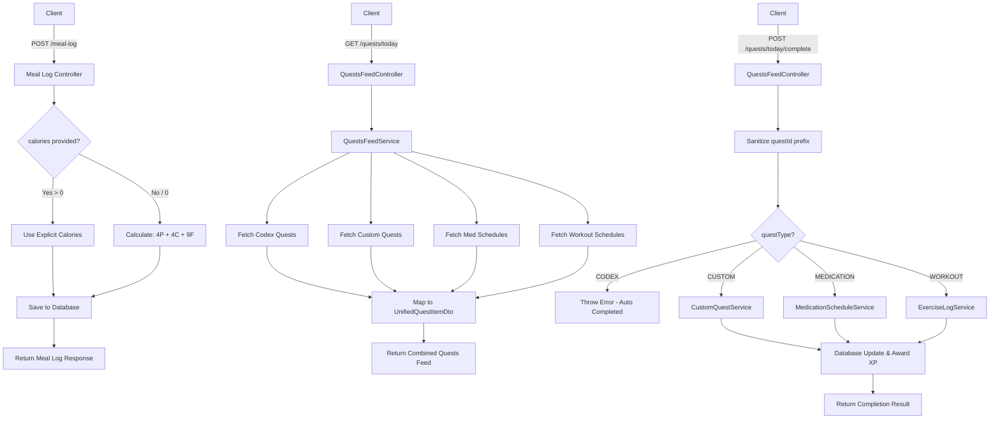

# Milestone 3 & Expedition V1: Unified Quests & Calorie Goals Implementation Document

## 1. Feature Name
Unified Quests Feed & Independent Calorie Goal Override

## 2. Short Description
This implementation consolidates four disparate quest/schedule sources (Codex Quests, Custom Quests, Scheduled Medications, Scheduled Workouts) into a single, unified "Today's Quests" feed with a centralized completion endpoint. It also allows meal logs to accept an explicit `calories` value (useful for barcode scanning) without strictly overriding it with macro-math derivations.

## 3. Actors
* **Authenticated User**: The end-user logging meals, viewing their daily quests, and marking quests/schedules as complete.
* **System**: The backend server enforcing macro/calorie math fallbacks, XP caps, and anti-abuse safeguards.

## 4. Preconditions
* The user must be authenticated with a valid JWT.
* To earn XP from completing quests, the user must be fully onboarded.

---

## 5. Complete Workflow Diagram



---

## 6. Route Inventory

| Method | Route | Authentication | Authorization | Description |
| ------ | ----- | -------------- | ------------- | ----------- |
| GET    | `/quests/today` | Required (JWT) | ValidUser | Retrieves the unified quests feed for the current day. |
| POST   | `/quests/today/complete` | Required (JWT) | ValidUser | Marks a specific unified quest as complete. |
| POST   | `/meal-log` | Required (JWT) | ValidUser | Creates a meal log (now accepts optional `calories` override). |
| PATCH  | `/meal-log/:id` | Required (JWT) | ValidUser | Updates a meal log (now accepts optional `calories` override). |

---

## 7. Concept & Frontend Implementation Guidelines (Universal)

This section provides implementation guidelines for frontend and client-side engineers interacting with these new APIs.

### 1. The Unified Quests Feed
**Concept:** The backend does the heavy lifting of aggregating tasks from different domains (Codex system quests, user custom quests, medications, exercises). You receive a flattened array of tasks.
**Frontend Guideline:** 
- Render the `GET /quests/today` response dynamically.
- Use the `questType` field to show an appropriate icon (e.g., pill for `MEDICATION_SCHEDULE`, dumbbell for `WORKOUT_SCHEDULE`, star for `CUSTOM`).
- Do NOT try to complete `CODEX` quests manually via the completion endpoint. They complete automatically when the user actually logs the requisite activity (e.g., logging 3 meals).
- When calling the completion API, you may pass the prefixed `id` directly (e.g. `workout_123`), the backend will safely strip the prefix.

### 2. Meal Log Barcode Flexibility
**Concept:** Previously, if a user scanned a barcode, the backend overwrote the barcode's listed calories by aggressively recalculating `(4*P) + (4*C) + (9*F)`. This frustrated users when food labels slightly deviated from pure math.
**Frontend Guideline:**
- When a user scans a barcode, or manually enters a specific calorie target, send the `calories` payload directly in the `POST /meal-log` or `PATCH /meal-log/:id` request.
- If you don't send `calories`, the backend will gracefully fallback to calculating it using macro multipliers.

---

## 8. Route-by-Route Documentation

### GET /quests/today

**Description:** Retrieves a consolidated list of today's tasks across all schedules and quest types.

**Authentication:** Required (`Bearer <token>`)

**Query Parameters:** None

**Response Example (200 OK):**
```json
{
  "success": true,
  "data": [
    {
      "id": "codex_three-meals",
      "title": "Three Meals a Day",
      "description": "Log breakfast, lunch, and dinner",
      "xpReward": 30,
      "isCompleted": true,
      "questType": "CODEX",
      "originalRefId": "three-meals"
    },
    {
      "id": "med_123e4567-e89b-12d3",
      "title": "Aspirin",
      "description": "Dose: 50mg",
      "xpReward": 10,
      "isCompleted": false,
      "questType": "MEDICATION_SCHEDULE",
      "originalRefId": "123e4567-e89b-12d3"
    }
  ],
  "meta": {
    "totalQuests": 2,
    "completedQuests": 1,
    "todayCustomXpEarned": 15,
    "dailyCustomXpCap": 50
  }
}
```

**cURL Example:**
```bash
curl -X GET "https://api.velvetiron.com/quests/today" \
  -H "Authorization: Bearer YOUR_ACCESS_TOKEN"
```

---

### POST /quests/today/complete

**Description:** Marks a unified quest as complete. Safely strips prefixes (e.g. `med_`) and routes to the correct underlying domain service.

**Authentication:** Required (`Bearer <token>`)

**Request Body:**

| Field | Type | Required | Description |
| ----- | ---- | -------- | ----------- |
| `questId` | string | Yes | The ID of the quest. Can be the prefixed `id` (e.g. `med_123`) or `originalRefId` (`123`). |
| `questType` | enum | Yes | `"CUSTOM"`, `"MEDICATION_SCHEDULE"`, `"WORKOUT_SCHEDULE"` |

*(Note: "CODEX" cannot be manually completed here).*

**Request Example:**
```json
{
  "questId": "med_123e4567-e89b-12d3",
  "questType": "MEDICATION_SCHEDULE"
}
```

**Response Example (200 OK):**
```json
{
  "success": true,
  "message": "Medication marked as taken",
  "xpAwarded": 10
}
```

**cURL Example:**
```bash
curl -X POST "https://api.velvetiron.com/quests/today/complete" \
  -H "Authorization: Bearer YOUR_ACCESS_TOKEN" \
  -H "Content-Type: application/json" \
  -d '{
    "questId": "med_123e4567-e89b-12d3",
    "questType": "MEDICATION_SCHEDULE"
  }'
```

---

### POST /meal-log & PATCH /meal-log/:id

**Description:** The existing meal logging endpoints have been updated to accept an optional `calories` override field.

**Database Impact:** Maps directly to `MealLog.calories` in the database. 

**Request Body Fields (Pertinent to Update):**

| Field | Type | Required | Description |
| ----- | ---- | -------- | ----------- |
| `carbs` | number | Yes (POST) | Carbohydrates in grams |
| `protein` | number | Yes (POST) | Protein in grams |
| `fats` | number | Yes (POST) | Fats in grams |
| `calories`| number | No | Optional manual calorie override. |

**Request Example:**
```json
{
  "mealType": "LUNCH",
  "carbs": 10,
  "protein": 10,
  "fats": 10,
  "calories": 250
}
```

**Business Rule:** If `calories` is omitted or left empty, the backend will calculate `(4 * 10) + (4 * 10) + (9 * 10) = 170` and save `170`. By passing `250`, the backend will save `250` exactly.

**cURL Example:**
```bash
curl -X POST "https://api.velvetiron.com/meal-log" \
  -H "Authorization: Bearer YOUR_ACCESS_TOKEN" \
  -H "Content-Type: application/json" \
  -d '{
    "mealType": "LUNCH",
    "carbs": 10,
    "protein": 10,
    "fats": 10,
    "calories": 250
  }'
```

---

## 9. Error Handling & Business Rules

* **400 Bad Request:** Occurs if you attempt to send `questType: "CODEX"` to the `/quests/today/complete` endpoint. The API will respond with:
  ```json
  {
    "statusCode": 400,
    "message": "Codex quests cannot be completed manually.",
    "error": "Bad Request"
  }
  ```
* **Anti-Abuse Cap:** When completing a `CUSTOM` quest, the backend queries the `XpLog` database for today. If the user has already earned 50 XP from custom quests today, the quest will be marked as complete in the database, but `0` XP will be awarded.
* **Idempotency:** Completing an already-completed medication or workout does not throw an error, but it guards against duplicate XP via the underlying service logic.
