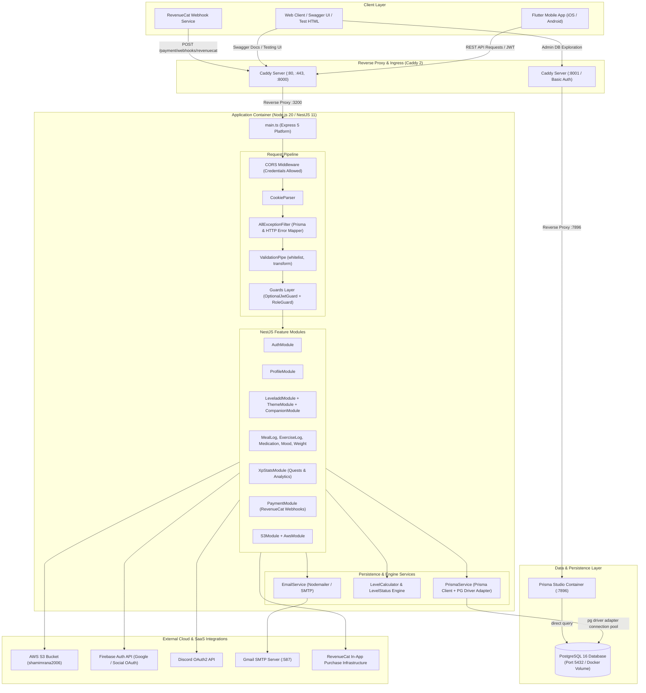
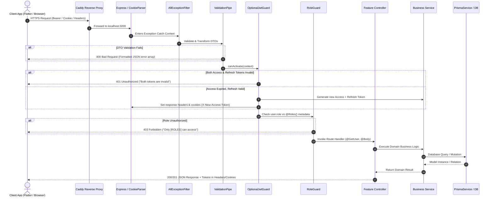

# Velvet & Iron Backend - Complete System Architecture

**Document ID:** `02-architecture.md`  
**Target Audience:** Software Architects, Backend Engineers, DevOps Engineers  

---

## 1. End-to-End System Architecture

The following diagram represents the actual production architecture of Velvet & Iron as deployed via Docker and reverse-proxied via Caddy:

---

## 2. Request-Response Lifecycle Detailed Flow

Every incoming HTTP request traverses a standardized execution pipeline inside NestJS:

---

## 3. Architecture Component Deep Dive

### 3.1 Platform Engine
* **Runtime:** Node.js v20 (Docker base image `node:20` build, `node:20-alpine` production runner).
* **Application Framework:** NestJS v11 running on Express 5 (`@nestjs/platform-express: ^11.0.1`, `express: ^5.2.1`).
* **Dependency Injection:** Hierarchical DI container managed by `@nestjs/core`.

### 3.2 Security and Ingress Layer
* **CORS Policy (`src/main.ts`):**
  * `origin: true` (reflects request origin, supporting mobile clients and web SPAs).
  * `credentials: true` (permits HTTP cookies across origins).
  * `exposedHeaders: ['X-New-Access-Token', 'X-New-Refresh-Token', 'X-Access-Token', 'X-Refresh-Token']`.
* **Cookie Parser:** Parses incoming `access_token` and `refresh_token` cookies for seamless browser-based sessions.
* **Global Filters:** `AllExceptionFilter` standardizes every exception into an RFC-compliant JSON envelope with exact Prisma error mapping.

### 3.3 Authentication & Token Rotation Engine
* Unlike vanilla Passport setups, this codebase uses an active, dual-transport token rotation pipeline:
  * Clients may send tokens in `Authorization: Bearer <token>` or cookies (`access_token`).
  * Refresh tokens can arrive via `X-Refresh-Token` header or cookies (`refresh_token`).
  * `OptionalJwtGuard` transparently refreshes expired access tokens **during the inflight request** without breaking the user session.
  * Sessions are persisted in the `sessions` PostgreSQL table for multi-device tracking and global revocation.

### 3.4 Data Access Architecture
* **ORM:** Prisma 7.2.0.
* **Multi-File Schema Architecture:** Schemas are organized in `prisma/schema/*.prisma` and linked through `prisma.config.ts`.
* **Database Driver Adapter:** Utilizes `@prisma/adapter-pg` with native `pg` client connection pooling rather than Prisma's binary Rust engine directly.
* **Access Paradigm:** Services inject `PrismaService` and invoke models through `this.prisma.client.<model>`.

### 3.5 Gamification & XP State Machine
* XP is awarded directly via `LeveladdService.addXpToUser()`.
* Every mutation increments `balanceXp` (spendable for themes/companions) and `totalEarnXp` (lifetime experience for level derivation).
* Levels are derived deterministically using `calculateLevel()`:
  $$\text{Level} = \min\left(50, \max\left(1, \left\lfloor\frac{\text{totalEarnXp} - 400}{150}\right\rfloor + 1\right)\right)$$
* Progression records are immutably written to `xp_logs`.

---

## 4. Synchronous vs. Asynchronous Operations

| Operation Type | Execution Nature | Mechanism | Impact / Notes |
| :--- | :--- | :--- | :--- |
| **HTTP Request/Response** | Synchronous (async/await) | NestJS Express Controllers | Client waits for DB read/write to return |
| **Email Dispatch** | Synchronous blocking | `await this.mailerService.sendMail()` | API requests wait for SMTP handshake; will slow down endpoint if SMTP server lags |
| **S3 Media Uploads** | Synchronous streaming | `s3.upload().promise()` | Server buffers file in memory via Multer, blocks until S3 confirms |
| **Firebase Token Verification** | Synchronous remote call | `admin.auth().verifyIdToken()` | Verifies cryptographic signature with Google public keys |
| **XP & Level Recomputation** | Synchronous transaction | Sequential Prisma updates | Updates `balanceXp`, `totalEarnXp`, recalculates level, updates `level` |
| **Background Queues / Workers** | **NONE** (`NOT FOUND`) | N/A | No BullMQ, Redis, Kafka, or background worker processes exist |
| **Scheduled Cron Jobs** | **NONE** (`NOT FOUND`) | N/A | No `@nestjs/schedule` or crons configured |
| **Database Seeding** | Lifecycle hook (`OnModuleInit`) | `SeedService.onModuleInit()` | Runs synchronously on NestJS boot before application listens for requests |

---

## 5. Network Topologies & Ports

| Component | Container Name | Host Port | Internal Port | Protocol / Exposure |
| :--- | :--- | :--- | :--- | :--- |
| **Caddy Web Server** | `caddy` | `80`, `443`, `8000`, `8001` | `80`, `443`, `8000`, `8001` | Publicly exposed to internet with automatic Let's Encrypt SSL |
| **Velvet Backend** | `velvet_backend` | `${SERVER_PORT}` (6000) | `3200` | Bridge network `app-network` (proxied by Caddy) |
| **PostgreSQL Database** | `velvet_backend_postgres`| `${POSTGRES_PORT}` (5432) | `5432` | Bound to localhost/bridge network |
| **Prisma Studio UI** | `velvet_backend_prisma_studio` | `${PRISMA_STUDIO_PORT_LOCAL}` (8462) | `7896` | Bridge network, basic-auth protected by Caddy on `:8001` |

