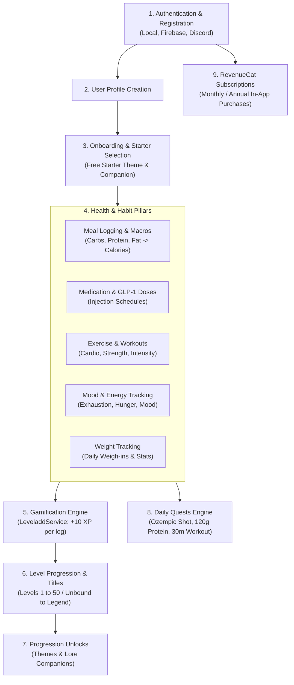

# Velvet & Iron Backend - Application Features Inventory

**Document ID:** `07-features-inventory.md`  
**Target Audience:** Product Managers, Technical Leads, Backend Developers  

---

## 1. Master Feature Inventory

The following is a comprehensive inventory of every business and technical capability implemented in the repository:

### 1.1 Local Authentication & Registration
* **Purpose:** Register new users, verify emails via OTP, authenticate with email/username and password.
* **Roles:** Unauthenticated (`Public`), `USER`, `ADMIN`, `SUPERADMIN`.
* **Backend Modules:** `AuthModule` (`src/auth`).
* **Controllers & Routes:** `AuthController` -> `POST /auth/register`, `POST /auth/login`, `GET /auth/me`, `DELETE /auth/logout`.
* **Services:** `AuthService`, `UserService`, `EmailService`.
* **Database Models:** `User`, `RefreshToken`, `Session`.
* **Validation:** `registerDto`, `loginDto` via `class-validator` (email format, password min length 6).
* **Business Rules:** Username is autogenerated from name if omitted; checks uniqueness; optional email verification gate (`EMAIL_VERIFICATION_REQUIRED`); sets dual JWT cookies & response headers.
* **Known Limitations:** `POST /auth/refresh-token` route handler is commented out in `auth.controller.ts` (handled dynamically in `OptionalJwtGuard`).

### 1.2 Social Authentication (Firebase & Discord)
* **Purpose:** Passwordless login via third-party identity providers.
* **Roles:** `Public`.
* **Backend Modules:** `AuthModule`, `LibModule`.
* **Controllers & Routes:** `POST /auth/firebase-login`, `GET /auth/discord-auth-url`, `GET /auth/discord`, `GET /auth/discord/callback`.
* **Services:** `AuthService`, `FirebaseAuthService`, `DiscordStrategy`.
* **Database Models:** `User` (`googleId`, `discord`), `Session`.
* **External Services:** Firebase Admin SDK (Google/Apple/FB), Discord OAuth2 API.
* **Business Rules:** Creates user account if non-existent, links ID if user already exists, generates 16-char random password and emails it to user via `sendGoogleAuthPassword()`. Redirects Discord callback to mobile via deep link `FLUTTER_DEEP_LINK_URL`.
* **Known Limitations:** Passwords generated for OAuth users are sent in plaintext via email.

### 1.3 User Onboarding & Free Starter Selection
* **Purpose:** Walkthrough onboarding process, establish fitness goals, and claim initial starter Theme & Companion.
* **Roles:** `USER`.
* **Backend Modules:** `OnboardingModule` (`src/onboarding`).
* **Controllers & Routes:** `PATCH /onboarding`, `GET /onboarding`, `POST /onboarding/theme/:themeId`, `POST /onboarding/companion/:companionId`.
* **Services:** `OnboardingService`.
* **Database Models:** `onboarding`, `User`, `UserProfile`, `UserTheme`, `UserCompanion`.
* **Business Rules:** Free starter theme and companion can **only** be unlocked if `onboarding.iscomplete == false`. Once completed, starter endpoints reject requests with `Cannot unlock theme after onboarding is complete`. Sets `user.onBoarded = true` and `userProfile.onBoardingCompleted = true`.

### 1.4 Gamification Engine (XP, Levels & Titles)
* **Purpose:** Calculate XP increments, track progression across 50 levels, award RPG status titles.
* **Roles:** `USER`.
* **Backend Modules:** `LeveladdModule` (`src/leveladd`), `ProfileModule` (`src/profile`).
* **Controllers & Routes:** `POST /profile/add-xp`, `POST /profile/add-xp/log`, `POST /profile/daily-login`.
* **Services:** `LeveladdService`, `ProfileService`.
* **Database Models:** `UserProfile` (`balanceXp`, `totalEarnXp`, `level`), `XpLog`.
* **Formula:** $\text{Level} = \min(50, \max(1, \lfloor(\text{totalEarnXp} - 400) / 150\rfloor + 1))$.
* **Business Rules:** Daily login XP can only be claimed once per calendar day (checked against `xp_logs.source == 'dayliLoggin'`).
* **Known Limitations:** Typo in database source string: `'dayliLoggin'`.

### 1.5 Themes & Companions Store
* **Purpose:** Browse, unlock with earned `balanceXp`, and activate fantasy UI themes and companion guides.
* **Roles:** `USER`, `ADMIN` (admin routes currently commented out).
* **Backend Modules:** `ThemeModule` (`src/theme`), `CompanionModule` (`src/companion`).
* **Controllers & Routes:** `GET /themes/my-themes`, `GET /themes/:id`, `POST /themes/:id/unlock`, `POST /themes/:id/activate`, `GET /companions/my-companions`, `GET /companions/:id`, `POST /companions/:id/unlock`, `POST /companions/:id/activate`.
* **Services:** `ThemeService`, `CompanionService`.
* **Database Models:** `Theme`, `Companion`, `UserTheme`, `UserCompanion`, `UserProfile`.
* **Business Rules:** Unlocking deducts `theme.unlockXp` or `companion.unlockXp` from `userProfile.balanceXp`. Unlocking is gated by user level:
  * Themes: Level $\ge 30$ (up to 4), $\ge 20$ (up to 3), $\ge 10$ (up to 2), $\ge 1$ (up to 1).
  * Companions: Level $\ge 32$ (up to 4), $\ge 22$ (up to 3), $\ge 12$ (up to 2), $< 10$ (1).
  * Only one theme and one companion can be `isActive: true` simultaneously per user.

### 1.6 GLP-1 Medication & Dosing Schedules
* **Purpose:** Register GLP-1 medications (Aspirin, Ozempic, Mounjaro), log doses, plan dosing schedules.
* **Roles:** `USER`.
* **Backend Modules:** `MedicationModule`, `MedicationScheduleModule`.
* **Controllers & Routes:** `POST /medication`, `GET /medication/history`, `GET /medication/:id`, `PATCH /medication/:id`, `DELETE /medication/:id`, `POST /medication-schedule`, `PATCH /medication-schedule/:id/taken`, `GET /medication-schedule/history`, `GET /medication-schedule/today`.
* **Services:** `MedicationService`, `MedicationScheduleService`.
* **Database Models:** `Medication`, `MedicationSchedule`.
* **Enums:** `MedicationType` (`CAPSULE`, `INJECTION`, `LIQUID`, `TABLET`).
* **Business Rules:** Scheduled doses can be toggled via `PATCH /medication-schedule/:id/taken?isTaken=true`.

### 1.7 Meal Logging, Macros & Planning
* **Purpose:** Log meals, track carbs/protein/fats, auto-calculate calories, and maintain meal schedules.
* **Roles:** `USER`.
* **Backend Modules:** `MealLogModule`, `MealScheduleModule`, `MacroGoalModule`.
* **Controllers & Routes:** `POST /meal-log`, `GET /meal-log/history`, `GET /meal-log/latest`, `PATCH /meal-log/:id`, `DELETE /meal-log/:id`, `POST /meal-schedule`, `PATCH /meal-schedule/:id/taken`, `POST /macro-goal`, `GET /macro-goal`.
* **Services:** `MealLogService`, `MealScheduleService`, `MacroGoalService`.
* **Database Models:** `MealLog`, `MealSchedule`, `MacroGoal`.
* **Enums:** `MealType` (`BREAKFAST`, `LUNCH`, `DINNER`, `SNACK`).
* **Calculation:** $\text{Calories} = (\text{carbs} \times 4) + (\text{protein} \times 4) + (\text{fats} \times 9)$.

### 1.8 Exercise & Workout Logging
* **Purpose:** Record cardio/strength/flexibility exercises with intensity and duration.
* **Roles:** `USER`.
* **Backend Modules:** `ExerciseLogModule`.
* **Controllers & Routes:** `POST /exercise-log`, `GET /exercise-log/history`, `POST /exercise-log/schedule`, `GET /exercise-log/schedule`, `PATCH /exercise-log/schedule/:id/taken`.
* **Services:** `ExerciseLogService`.
* **Database Models:** `ExerciseLog`, `ExerciseScheduleLog`.
* **Enums:** `exercise_type` (`CARDIO`, `STRENGTH`, `FLEXIBILITY`, `BALANCE`), `exercise_intensity` (`LOW`, `MEDIUM`, `HIGH`).

### 1.9 Mood & Energy Tracking
* **Purpose:** Monitor daily subjective wellbeing, hunger levels, and energy fluctuations.
* **Roles:** `USER`.
* **Backend Modules:** `MoodLogModule`.
* **Controllers & Routes:** `POST /mood-log`, `GET /mood-log/history`, `GET /mood-log/latest`, `GET /mood-log/today`, `PATCH /mood-log/:id`, `DELETE /mood-log/:id`.
* **Services:** `MoodLogService`.
* **Database Models:** `MoodLog`.
* **Enums:** `Mood` (`TIRED`, `GOOD`, `PISSED`, `GREAT`, `POOR`), `EnergyLevel` (`EXHAUSTED`, `LOW`, `MODERATE`, `ENERGIZED`, `HIGH`), `HungerLevel` (`NOT_HUNGRY`, `HUNGRY`, `VERY_HUNGRY`).

### 1.10 Body Weight Tracking & Analytics
* **Purpose:** Log body weight, calculate delta progress, and render 7-day weight charts.
* **Roles:** `USER`.
* **Backend Modules:** `WeightLogModule`.
* **Controllers & Routes:** `POST /weight-log`, `GET /weight-log/history`, `GET /weight-log/chart/weekly`, `GET /weight-log/today`, `PATCH /weight-log/today`.
* **Services:** `WeightLogService`.
* **Database Models:** `WeightLog`.

### 1.11 Daily Quests & Analytics
* **Purpose:** Real-time query aggregating whether the user completed 5 daily health tasks.
* **Roles:** `USER`.
* **Backend Modules:** `XpStatsModule`.
* **Controllers & Routes:** `GET /xp-stats/today`, `GET /xp-stats/quests`, `GET /xp-stats/weekly`, `GET /xp-stats/monthly`, `GET /xp-stats/summary`, `GET /xp-stats/logs`, `GET /xp-stats/chart/weekly`, `GET /xp-stats/chart/monthly`.
* **Services:** `XpStatsService`.
* **Quests Evaluated:**
  1. `track-your-shot` (10 XP): Logged medication today.
  2. `three-meals` (30 XP): Logged breakfast, lunch, and dinner today.
  3. `mood-check` (30 XP): Logged mood/energy today.
  4. `step-master` (20 XP): Total exercise duration $\ge 30$ minutes.
  5. `protein-power` (30 XP): Total protein consumed $\ge 120\text{g}$.

### 1.12 In-App Subscriptions (RevenueCat)
* **Purpose:** Webhook integration to record app store subscription purchases and grant premium status.
* **Roles:** Webhook (`Public` + Secret Verification), `USER` (read status), `ADMIN` (manual test update).
* **Backend Modules:** `PaymentModule`.
* **Controllers & Routes:** `POST /payment/webhooks/revenuecat`, `GET /payment/subscription`, `GET /payment/history`, `PATCH /payment/subscription`.
* **Services:** `PaymentService`.
* **Database Models:** `Subscription`, `SubscriptionEvent`.
* **External Service:** RevenueCat.

### 1.13 AWS S3 Asset Management
* **Purpose:** Upload and host user avatars and profile photos.
* **Roles:** `USER` (`PATCH /auth/profile`), `Public` (`POST /s3/upload`, `POST /s3/upload-multiple`).
* **Backend Modules:** `S3Module`, `AwsModule`.
* **Controllers & Routes:** `POST /s3/upload`, `POST /s3/upload-multiple`.
* **Services:** `AwsService`.
* **External Service:** AWS S3.
* **Known Limitations:** `/s3/upload` endpoints have no authentication guards.

---

## 2. Feature Dependency Map

