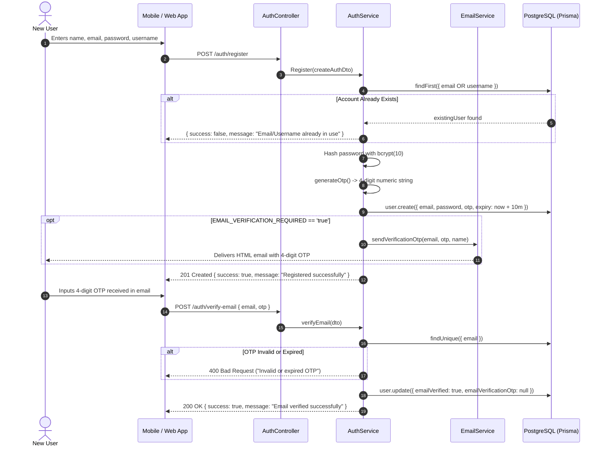
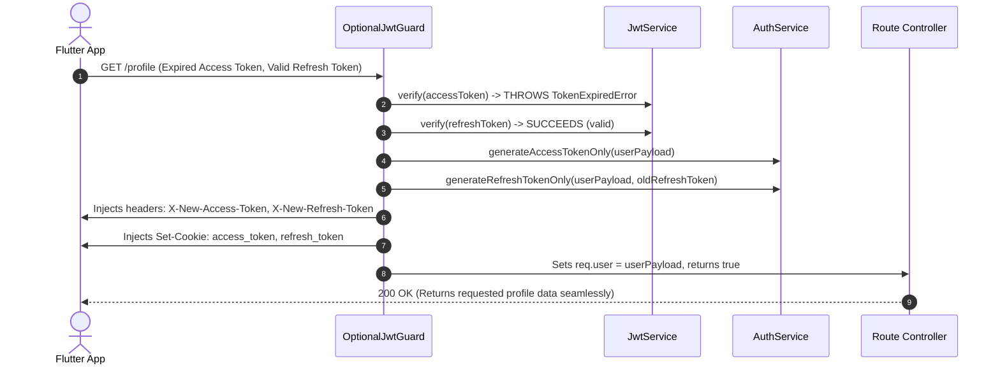
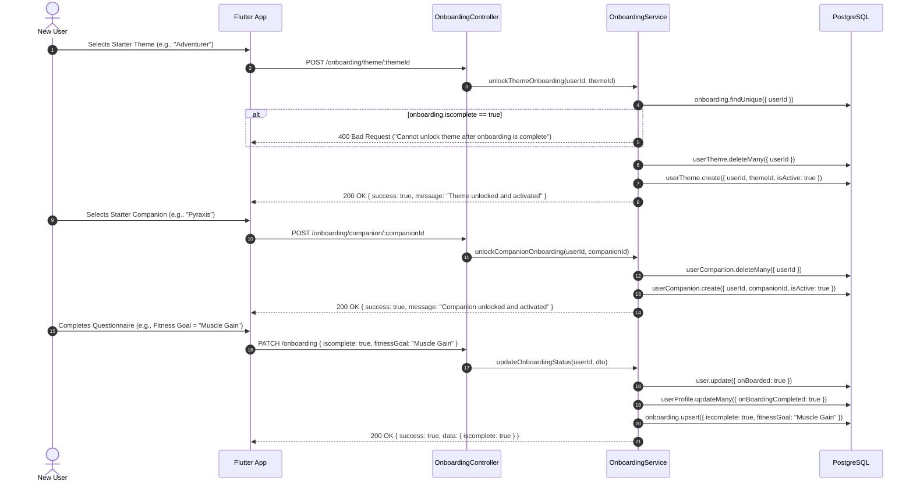
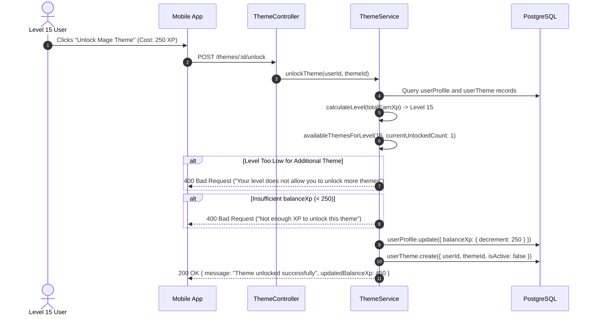
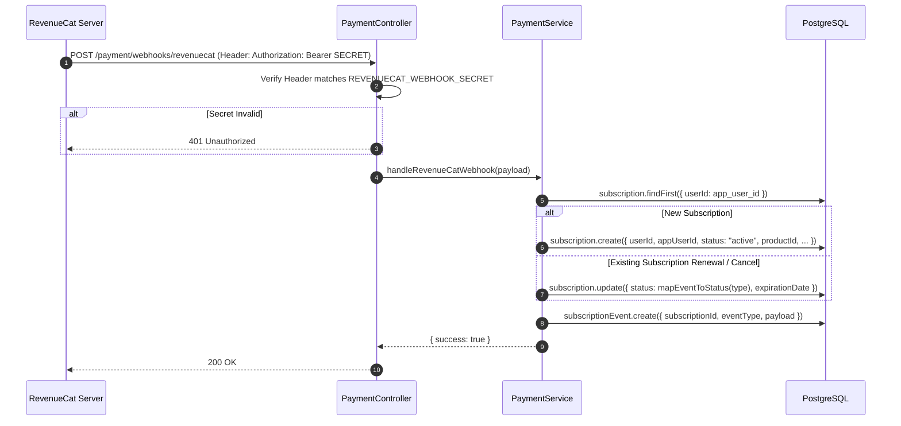

# Velvet & Iron Backend - Complete User Workflows

**Document ID:** `08-user-workflows.md`  
**Target Audience:** Backend Engineers, Mobile Developers, QA Automation Engineers  

---

## 1. User Registration & Email Verification Workflow

### Purpose
Allows a new user to create an account, generates a 4-digit verification OTP, emails the code via SMTP, and verifies the email.



* **Actor:** Unauthenticated visitor.
* **Database Mutations:**
  * `INSERT INTO users`: creates record with `emailVerified: false`, `emailVerificationOtp: "XXXX"`, `emailVerificationExpiry`.
  * `UPDATE users`: sets `emailVerified: true`, clears OTP columns.
* **Failure Modes:** 
  * Duplicate email/username: returns `{ success: false }`.
  * Expired OTP (>10 mins): throws `BadRequestException`.

---

## 2. Standard Login & Session Token Issuance

### Purpose
Authenticates a user via local credentials, generates JWT access and refresh tokens, creates a tracked session in the database, and delivers tokens via dual channels (JSON body + HTTP cookies + response headers).

* **Trigger:** User submits `emailOrUsername` and `password` on `POST /auth/login`.
* **Flow:**
  1. Passport `LocalStrategy` calls `AuthService.validateUser(emailOrUsername, password)`.
  2. Queries `User` where `email == input OR username == input`.
  3. Compares plaintext password against `user.password` using `bcrypt.compare()`.
  4. If `EMAIL_VERIFICATION_REQUIRED === 'true'` and `user.emailVerified === false`, throws `401 Unauthorized`.
  5. `AuthService.generateTokens()` signs:
     * `access_token`: payload `{ id, email, name, role }` with lifespan based on `ACCESS_TOKEN_EXPIRATION_MS`.
     * `refresh_token`: payload `{ id, email, name, role }` with lifespan based on `REFRESH_TOKEN_EXPIRATION_MS`.
  6. `AuthController.login()` sets:
     * Cookie `access_token`: `maxAge: accessTokenExpirMs`, `sameSite: 'lax'`, `secure: isProduction`.
     * Cookie `refresh_token`: `maxAge: refreshTokenExpirMs`.
     * Header `X-Access-Token`: `<token>`.
     * Header `X-Refresh-Token`: `<token>`.
  7. Returns JSON response containing `{ access_token, refresh_token, user }`.

---

## 3. Inflight Dual-Token Auto-Refresh Workflow

### Purpose
Allows an authorized user with an expired access token to continue making API requests uninterrupted without manual token refresh round-trips.



---

## 4. Discord OAuth Mobile Deep-Link Workflow

### Purpose
Authenticates users via Discord on mobile, provisions accounts with a generated password, and redirects back into Flutter via custom URL scheme.

1. **Initiation:** Mobile client opens URL `GET /auth/discord` in system browser.
2. **Discord Auth:** User authorizes the application on Discord's consent screen.
3. **Callback Handling:** Discord redirects browser to `GET /auth/discord/callback?code=...`.
4. **Account Resolution:**
   * Checks if user exists with matching `discordId` or `email`.
   * If non-existent: generates 16-character secure random password, hashes it, creates `User` record, assigns unique username, and sends credentials via `emailService.sendGoogleAuthPassword()`.
   * If existing: links `user.discord = discordId` and sets `emailVerified = true`.
5. **Token Generation:** Signs new `access_token` and `refresh_token`.
6. **Mobile Deep-Link Redirect:**
   * Backend issues an HTTP 302 redirect to:
     ```text
     velvetapp://auth/discordapp?access_token=<JWT>&refresh_token=<JWT>&user=<ENCODED_JSON>
     ```
   * Operating system hands redirect to Flutter app, which parses tokens and transitions to logged-in state.

---

## 5. Onboarding & Free Starter Theme/Companion Claim

### Purpose
New users select their fitness goal and claim their free starter Theme and Lore Companion without spending XP.



---

## 6. Meal Logging & Automated Calorie Calculation

### Purpose
Allows users to log nutritional intake by entering raw macronutrients. Caloric values are derived automatically on the backend.

* **Actor:** Authenticated `USER`.
* **Trigger:** `POST /meal-log` with body `{ mealType: "LUNCH", description: "Grilled Chicken Salad", carbs: 15, protein: 45, fats: 12 }`.
* **Backend Processing:**
  1. Computes total calories:
     $$\text{Calories} = (15 \times 4) + (45 \times 4) + (12 \times 9) = 60 + 180 + 108 = 348\text{ kcal}$$
  2. Evaluates XP award condition:
     ```typescript
     // Current codebase behavior:
     if (user && !user.onBoarded) {
       await this.leveladdService.addXpToUser(userId, 10, 'Meal log entry');
     }
     ```
  3. Creates record in `meal_logs` with computed calories.
  4. Returns complete `MealLogResponseDto`.
* **Side Effects:** If user has not completed onboarding, awards 10 XP, creates an entry in `xp_logs`, and recalculates user level.

---

## 7. GLP-1 Medication Schedule & Adherence Tracking

### Purpose
Tracks subcutaneous injections (semaglutide, tirzepatide) or oral medications and records when doses are taken.

1. **Schedule Creation:**
   * User submits `POST /medication-schedule` with `{ name: "Ozempic", type: "INJECTION", doseMg: 1, scheduleTime: "2026-03-01T09:00:00Z" }`.
   * Record created in `medication_schedules` with `isTaken: false`.
2. **Taking the Dose:**
   * User clicks "Mark Taken" in the app on injection day.
   * Client calls `PATCH /medication-schedule/:id/taken?isTaken=true`.
   * Backend updates `medication_schedules.isTaken = true`.
   * If `!user.onBoarded`, calls `LeveladdService.addXpToUser(userId, 10, 'Medication schedule marked as taken')`.
3. **Daily Quest Update:**
   * `GET /xp-stats/quests` checks if any medication was taken today.
   * Marks quest `track-your-shot` as `isDone: true`.

---

## 8. Theme / Companion XP Store Unlock Workflow

### Purpose
Allows high-level users to spend earned `balanceXp` to unlock additional fantasy themes and companions.



---

## 9. RevenueCat Subscription Webhook Workflow

### Purpose
Receives asynchronous purchase and cancellation events from Apple App Store and Google Play Store via RevenueCat.



