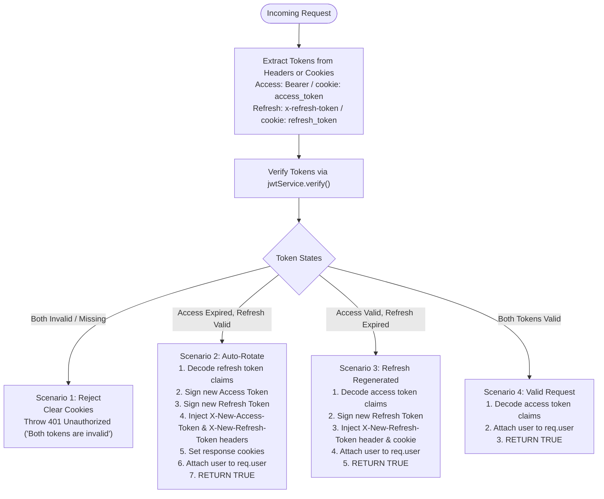
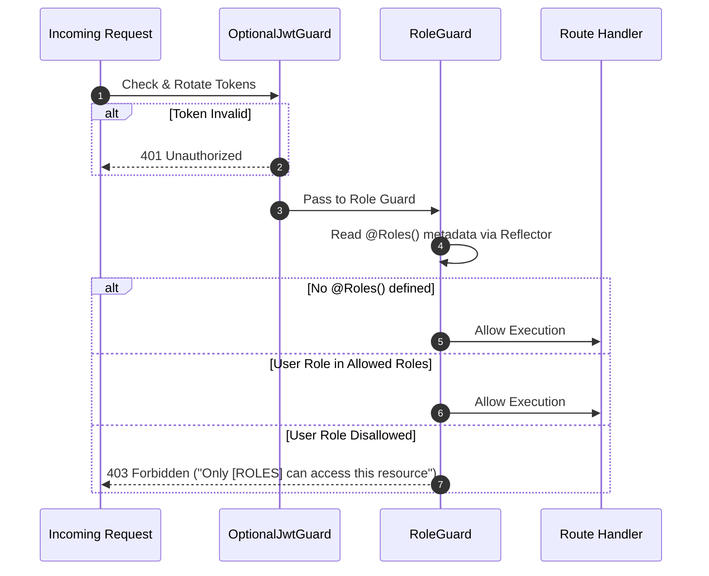

# Velvet & Iron Backend - Authentication & Authorization Architecture

**Document ID:** `10-authentication-authorization.md`  
**Target Audience:** Security Engineers, Backend Developers, Mobile Integration Engineers  

---

## 1. Authentication Architecture Overview

The Velvet & Iron authentication subsystem supports multi-protocol identification:
1. **Local Credentials:** Email/username and bcrypt password hashing.
2. **Email OTP Verification:** 4-digit numeric OTP sent via SMTP with 10-minute expiry.
3. **Firebase Social Identity:** Verifies cryptographic ID tokens from Google, Apple, Facebook, GitHub.
4. **Discord OAuth2:** Standard authorization code grant with mobile deep-link redirection.
5. **Session Management:** Multi-device active session tracking in PostgreSQL `sessions` table.
6. **Dual-Transport Auto-Rotating JWTs:** Seamless session continuation through header and cookie rotation.

---

## 2. Token Specifications & Configuration

Tokens are signed using `@nestjs/jwt` with symmetric HMAC-SHA256 (`HS256`):

```typescript
// Minimal token payload structure
interface JwtPayload {
  id: string;        // User UUID
  email: string;     // User email
  name: string;      // Display name
  role: string;      // 'USER' | 'ADMIN' | 'SUPERADMIN'
}
```

### Lifespan Computation Logic (`src/auth/auth.service.ts`)
* **Access Token:** Configured via `ACCESS_TOKEN_EXPIRATION_MS`. The service calculates:
  $$\text{Days} = \frac{\text{ACCESS\_TOKEN\_EXPIRATION\_MS}}{86,400,000} \parallel 15$$
  Signed with `expiresIn: `${accessTokenExpiration}d``.
* **Refresh Token:** Configured via `REFRESH_TOKEN_EXPIRATION_MS`. The service calculates:
  $$\text{Days} = \frac{\text{REFRESH\_TOKEN\_EXPIRATION\_MS}}{86,400,000} \parallel 7$$
  Signed with `expiresIn: `${refreshTokenExpiration}d``.

### Secret Management
* Read from `process.env.JWT_SECRET`.
* **Vulnerability Notice:** `src/lib/strategy/jwt.ts` includes a hardcoded fallback:
  ```typescript
  secretOrKey: secret || 'secretKey',
  ```
  If `JWT_SECRET` is unset, the system signs and accepts tokens using `'secretKey'`.

---

## 3. The `OptionalJwtGuard` State Machine

The core security gate of the application is `OptionalJwtGuard` (`src/common/optional-auth.guard.ts`). It handles 4 distinct token scenarios on **every request**:



---

## 4. Authorization Flow & Role Guards

Authorization is enforced via composable decorators defined in `src/common/decorators/validate.decorator.ts`:



### Composite Decorator Matrix

| Decorator | Guard Chain | Allowed Roles | Typical Usage |
| :--- | :--- | :--- | :--- |
| `@ValidAll()` | `OptionalJwtGuard` | Any authenticated user (no role filter) | Usernames, general utility |
| `@ValidUser()` | `OptionalJwtGuard` $\to$ `RoleGuard` | `USER`, `ADMIN`, `SUPERADMIN` | Health tracking, profiles, store |
| `@ValidAdmin()` | `OptionalJwtGuard` $\to$ `RoleGuard` | `ADMIN`, `SUPERADMIN` | Test overrides, logout all |
| `@ValidSuperAdmin()`| `OptionalJwtGuard` $\to$ `RoleGuard` | `SUPERADMIN` | System-level administrative actions |

---

## 5. Multi-Device Session Management

The `sessions` table in PostgreSQL tracks active devices for multi-device authorization:

```prisma
model Session {
    id           String   @id @default(uuid())
    userId       String
    user         User     @relation(fields: [userId], references: [id], onDelete: Cascade)
    deviceInfo   String?
    ipAddress    String?
    refreshToken String   @unique
    expiresAt    DateTime
    createdAt    DateTime @default(now())
    lastActivity DateTime @default(now())
}
```

* **Session Listing:** `GET /auth/sessions` returns active sessions with IP and device info.
* **Current Device Logout:** `DELETE /auth/logout` deletes all sessions for the user and clears client cookies.
* **Global Logout:** `DELETE /auth/logout-all` (currently protected by `@ValidAdmin()`) clears all active sessions for a target user ID.
* **Password Reset Side Effect:** Performing a password reset via `POST /auth/reset-password` automatically deletes all rows from `sessions` for that user.

---

## 6. Security Analysis & Vulnerabilities Identified

### Finding 1: Unauthenticated Sensitive Endpoints
* **Location:** `src/user/user.controller.ts`
* **Evidence:**
  ```typescript
  @Get()
  findAll() { return this.userService.findAll(); }
  
  @Get(':id')
  findOne(@Param('id') id: string) { return this.userService.findOne(id); }
  ```
* **Risk:** The entire user list (names, emails, avatars, roles) and user detail by ID are publicly accessible without authentication.
* **Recommendation:** Add `@ValidAdmin()` to `UserController`.

### Finding 2: Unauthenticated S3 File Uploads
* **Location:** `src/s3/s3.controller.ts`
* **Evidence:** `POST /s3/upload` and `POST /s3/upload-multiple` lack any guard decorator.
* **Risk:** Arbitrary external actors can upload unlimited 10MB files to the AWS S3 bucket.
* **Recommendation:** Attach `@ValidUser()`.

### Finding 3: Plaintext Generated Passwords via Email
* **Location:** `src/auth/auth.service.ts` (lines 842, 952) and `src/email/email.service.ts` (line 93)
* **Evidence:** When users authenticate via Google/Firebase or Discord for the first time, a random password is generated and sent via unencrypted SMTP in HTML:
  ```html
  <p><strong>Password:</strong> ${password}</p>
  ```
* **Risk:** Plaintext credential exposure over email transit.
* **Recommendation:** Remove auto-generated password emails. Allow OAuth users to use passwordless logins or explicit password-creation flows.

