# Velvet & Iron Backend - Database Architecture & Schema Documentation

**Document ID:** `11-database.md`  
**Target Audience:** Database Administrators, Backend Engineers, Data Architects  
**ORM Engine:** Prisma 7.2.0 with `@prisma/adapter-pg`  
**Database Engine:** PostgreSQL 16  

---

## 1. Entity-Relationship Diagram (ERD)

```mermaid
erDiagram
    User ||--o| UserProfile : "has profile"
    User ||--o{ UserTheme : "unlocks"
    User ||--o{ UserCompanion : "unlocks"
    User ||--o{ RefreshToken : "owns"
    User ||--o{ Session : "maintains"
    User ||--o{ WeightLog : "records"
    User ||--o{ MoodLog : "records"
    User ||--o{ MealLog : "records"
    User ||--o{ MealSchedule : "schedules"
    User ||--o{ Medication : "owns"
    User ||--o{ MedicationSchedule : "schedules"
    User ||--o{ ExerciseLog : "records"
    User ||--o{ ExerciseScheduleLog : "schedules"
    User ||--o{ XpLog : "earns"
    User ||--o| onboarding : "undergoes"
    User ||--o{ MacroGoal : "defines"
    User ||--o| Subscription : "subscribes"

    Theme ||--o{ UserTheme : "unlocked by"
    Theme ||--o{ UserProfile : "active in"

    Companion ||--o{ UserCompanion : "unlocked by"
    Companion ||--o{ UserProfile : "active in"

    Subscription ||--o{ SubscriptionEvent : "records"

    User {
        string id PK "uuid"
        string email UK
        string username UK
        string password "bcrypt hash"
        string name
        string avatar
        string profilePhoto
        string gender
        datetime dateOfBirth
        boolean emailVerified
        string emailVerificationOtp
        datetime emailVerificationExpiry
        string resetPasswordOtp
        datetime resetPasswordOtpExpiry
        boolean resetPasswordVerified
        boolean onBoarded
        string googleId UK
        string githubId UK
        string discord UK
        UserRole role "USER, ADMIN, SUPERADMIN"
        boolean isActive
        datetime createdAt
        datetime updatedAt
    }

    UserProfile {
        string id PK "uuid"
        string userId FK,UK
        string activeThemeId FK
        string activeCompanionId FK
        int themeCredits
        int companionCredits
        int totalEarnXp
        int balanceXp
        int level
        boolean onBoardingCompleted
        string fitnessGoal
        datetime createdAt
        datetime updatedAt
    }

    Theme {
        string id PK "uuid"
        string name UK
        string tagline
        string description
        int unlockXp
        datetime createdAt
    }

    Companion {
        string id PK "uuid"
        string name
        string title
        string quote
        int unlockXp
        datetime createdAt
    }

    UserTheme {
        string id PK "uuid"
        string userId FK
        string themeId FK
        datetime unlockedAt
        boolean isActive
    }

    UserCompanion {
        string id PK "uuid"
        string userId FK
        string companionId FK
        datetime unlockedAt
        boolean isActive
    }

    WeightLog {
        string id PK "uuid"
        string userId FK
        string weight
        string note
        int earnedXp
        datetime loggedAt
    }

    MoodLog {
        string id PK "uuid"
        string userId FK
        Mood mood
        EnergyLevel energyLevel
        HungerLevel hungerLevel
        string note
        int earnedXp
        datetime loggedAt
    }

    MealLog {
        string id PK "uuid"
        string userId FK
        MealType mealType
        string description
        int calories
        int carbs
        int protein
        int fats
        boolean isTaken
        int earnedXp
        datetime loggedAt
    }

    MealSchedule {
        string id PK "uuid"
        string userId FK
        MealType mealType
        datetime scheduledAt
        boolean isTaken
        int calories
        int carbs
        int protein
        int fats
        int earnedXp
    }

    Medication {
        string id PK "uuid"
        string userId FK
        string name
        MedicationType type
        int doseMg
        boolean isTaken
        int earnedXp
        datetime createdAt
    }

    MedicationSchedule {
        string id PK "uuid"
        string userId FK
        string name
        MedicationType type
        int doseMg
        datetime scheduleTime
        boolean isTaken
        int earnedXp
    }

    ExerciseLog {
        string id PK "uuid"
        string userId FK
        exercise_type type
        string name
        exercise_intensity intensity
        int duration
        boolean isTaken
        int earnedXp
        string note
        datetime loggedAt
    }

    ExerciseScheduleLog {
        string id PK "uuid"
        string userId FK
        exercise_type type
        string name
        exercise_intensity intensity
        int duration
        boolean isTaken
        int earnedXp
        string note
        datetime loggedAt
    }

    MacroGoal {
        string id PK "uuid"
        string userId FK
        string name
        float carbs
        float fat
        float protein
        float calories
        datetime createdAt
        datetime updatedAt
    }

    XpLog {
        string id PK "uuid"
        string userId FK
        int amount
        string source
        datetime createdAt
    }

    Subscription {
        string id PK "cuid"
        string userId FK,UK
        string appUserId UK
        string productId
        string store
        boolean isTrial
        datetime trialStart
        datetime trialEnd
        string status
        string originalTransactionId
        datetime purchaseDate
        datetime expirationDate
        datetime createdAt
        datetime updatedAt
    }

    SubscriptionEvent {
        string id PK "cuid"
        string subscriptionId FK
        string eventType
        json payload
        datetime receivedAt
    }
```



---

## 2. Table-by-Table Specifications

### 2.1 Table: `users` (`prisma/schema/user.prisma`)
* **Primary Key:** `id` (`TEXT`, default `uuid()`).
* **Indexes & Constraints:**
  * Unique: `email`, `username`, `googleId`, `githubId`, `discord`.
  * Index: `email`.
* **Relations:** One-to-One with `UserProfile`, `onboarding`, `Subscription`. One-to-Many with all tracking, log, theme, companion, and session tables.
* **Cascading:** All child tracking logs and sessions specify `onDelete: Cascade`.

### 2.2 Table: `user_profiles` (`prisma/schema/userProfile.prisma`)
* **Primary Key:** `id` (`TEXT`, default `uuid()`).
* **Foreign Keys:**
  * `userId`: references `users(id)` `ON DELETE CASCADE`. Unique constraint.
  * `activeThemeId`: references `themes(id)` `ON DELETE SET NULL`.
  * `activeCompanionId`: references `companions(id)` `ON DELETE SET NULL`.
* **XP Tracking Columns:**
  * `balanceXp` (`INT`, default 0): Spendable XP balance for unlocking themes/companions. Decremented on store unlock.
  * `totalEarnXp` (`INT`, default 0): Lifetime cumulative XP earned. Never decreases; used to calculate level.
  * `level` (`INT`, default 1): Cached user level (1 to 50).

### 2.3 Table: `themes` (`prisma/schema/gamification.prisma`)
* **Primary Key:** `id` (`TEXT`, default `uuid()`).
* **Unique Constraints:** `name`.
* **Columns:** `tagline`, `description`, `unlockXp` (`INT`, default 0).
* **Seeded Values:**
  * *Adventurer* (`unlockXp: 250`) - "Embrace the Journey"
  * *Reader* (`unlockXp: 250`) - "Knowledge is Power"
  * *Mage* (`unlockXp: 250`) - "Master the Arcane"
  * *Gamer* (`unlockXp: 250`) - "Level Up Your Life"

### 2.4 Table: `companions` (`prisma/schema/gamification.prisma`)
* **Primary Key:** `id` (`TEXT`, default `uuid()`).
* **Columns:** `name`, `title`, `quote`, `unlockXp` (`INT`, default 0).
* **Seeded Values:**
  * *Ser Kael Thornwatch* - "The Unbroken" (`unlockXp: 250`)
  * *Riven Ashcroft* - "High Lord of the Veil" (`unlockXp: 250`)
  * *Pyraxis* - "The Emberbound" (`unlockXp: 250`)
  * *Bram Ironledger* - "Keeper of the Codex" (`unlockXp: 250`)

### 2.5 Table: `user_themes` & `user_companions`
* **Compound Unique Constraints:**
  * `user_themes`: `@@unique([userId, themeId])`
  * `user_companions`: `@@unique([userId, companionId])`
* **Purpose:** Join tables tracking unlocked catalog assets. `isActive: Boolean` designates the user's currently equipped theme/companion.

### 2.6 Table: `xp_logs` (`prisma/schema/xp-log.prisma`)
* **Primary Key:** `id` (`TEXT`, default `uuid()`).
* **Indexes:** `userId`, `createdAt`, compound `@@index([userId, createdAt])`.
* **Columns:** `amount` (`INT`), `source` (`TEXT`, e.g. `'dayliLoggin'`, `'Meal log entry'`, `'MANUAL'`).
* **Purpose:** Immutable audit ledger of all XP credits and debits.

### 2.7 Tables: Health Tracking Matrix (`prisma/schema/health-tracking.prisma`)
* `weight_logs`: `weight` (`TEXT`), `note`, `earnedXp: 10`, `loggedAt`. Indexes on `userId`, `loggedAt`.
* `mood_logs`: `mood` (`Mood`), `energyLevel` (`EnergyLevel`), `hungerLevel` (`HungerLevel`), `earnedXp: 10`.
* `meal_logs`: `mealType` (`MealType`), `calories` (`INT`), `carbs`, `protein`, `fats`, `isTaken: true`, `earnedXp: 10`.
* `meal_schedules`: Planned meals with `scheduledAt`, `isTaken: false`.
* `medications`: Master medication list (`name`, `type`, `doseMg`).
* `medication_schedules`: Dosing schedule with `scheduleTime`, `isTaken: false`.
* `exercise_logs`: Workout records with `type` (`exercise_type`), `intensity` (`exercise_intensity`), `duration` in minutes.
* `exercise_schedule_logs`: Scheduled future workout sessions.

### 2.8 Table: `Subscription` & `SubscriptionEvent` (`prisma/schema/payments.prisma`)
* `Subscription`: `id` (`TEXT`, default `cuid()`), `userId` (Unique FK to `users`), `appUserId` (RevenueCat ID, unique), `productId`, `store`, `isTrial`, `status` (`active`, `cancelled`, `expired`, `billing_issue`), `expirationDate`.
* `SubscriptionEvent`: Immutable historical log of RevenueCat JSON payloads received via webhooks.

---

## 3. Database Enums

```prisma
enum UserRole {
    SUPERADMIN
    ADMIN
    USER
}

enum Mood {
    TIRED
    GOOD
    PISSED
    GREAT
    POOR
}

enum EnergyLevel {
    EXHAUSTED
    LOW
    MODERATE
    ENERGIZED
    HIGH
}

enum HungerLevel {
    NOT_HUNGRY
    HUNGRY
    VERY_HUNGRY
}

enum MealType {
    BREAKFAST
    LUNCH
    DINNER
    SNACK
}

enum MedicationType {
    CAPSULE
    INJECTION
    LIQUID
    TABLET
}

enum exercise_type {
    CARDIO
    STRENGTH
    FLEXIBILITY
    BALANCE
}

enum exercise_intensity {
    MEDIUM
    LOW
    HIGH
}
```

---

## 4. Multi-File Schema Configuration

Prisma multi-file support is enabled via `prisma.config.ts`:
```typescript
import dotenv from 'dotenv';
import dotenvExpand from 'dotenv-expand';
import { defineConfig } from 'prisma/config';

const myEnv = dotenv.config();
dotenvExpand.expand(myEnv);

export default defineConfig({
  schema: 'prisma/schema',
  migrations: {
    path: 'prisma/migrations',
  },
  datasource: {
    url: process.env['DATABASE_URL'],
  },
});
```

* All `.prisma` files inside `prisma/schema/` are merged into a single logical schema during `npx prisma generate` and `npx prisma migrate dev`.
* Generated client output location is specified in `prisma/schema/schema.prisma`:
  ```prisma
  generator client {
    provider = "prisma-client"
    output   = "../generated"
  }
  ```

