# Velvet & Iron Backend - Backend Architecture & Service Engineering

**Document ID:** `14-backend.md`  
**Target Audience:** Senior Backend Engineers, NestJS Developers  

---

## 1. NestJS Module Dependency Graph

The root application module is `AppModule` (`src/app.module.ts`). The module import graph is structured as follows:

```mermaid
graph TD
    AppModule --> PrismaModule
    AppModule --> ConfigModule
    AppModule --> GuardsModule
    AppModule --> UserModule
    AppModule --> AuthModule
    AppModule --> ProfileModule
    AppModule --> LeveladdModule
    AppModule --> ThemeModule
    AppModule --> CompanionModule
    AppModule --> OnboardingModule
    AppModule --> MacroGoalModule
    AppModule --> MealLogModule
    AppModule --> MealScheduleModule
    AppModule --> MedicationModule
    AppModule --> MedicationScheduleModule
    AppModule --> ExerciseLogModule
    AppModule --> MoodLogModule
    AppModule --> WeightLogModule
    AppModule --> XpStatsModule
    AppModule --> XpTimeoutModule
    AppModule --> PaymentModule
    AppModule --> S3Module
    AppModule --> AwsModule
    AppModule --> EmailModule

    AuthModule --> UserModule
    AuthModule --> EmailModule
    AuthModule --> AwsModule
    
    ProfileModule --> LeveladdModule
    ProfileModule --> MealScheduleModule
    ProfileModule --> MedicationScheduleModule
    ProfileModule --> ExerciseLogModule
    ProfileModule --> XpStatsModule

    ThemeModule --> LeveladdModule
    CompanionModule --> LeveladdModule
    OnboardingModule --> PrismaModule
    
    MealLogModule --> LeveladdModule
    MealScheduleModule --> LeveladdModule
    MedicationModule --> LeveladdModule
    MedicationScheduleModule --> LeveladdModule
    ExerciseLogModule --> LeveladdModule
    MoodLogModule --> LeveladdModule
    WeightLogModule --> LeveladdModule

    S3Module --> AwsModule
```



---

## 2. Global Pipeline Configuration (`src/main.ts`)

1. **Platform:** `NestFactory.create<NestExpressApplication>(AppModule)`.
2. **CORS:** `origin: true`, `credentials: true`, exposed token headers.
3. **Cookie Middleware:** `app.use(cookieParser())`.
4. **Global Filters:** `app.useGlobalFilters(new AllExceptionFilter())`.
5. **Global Validation:**
   ```typescript
   app.useGlobalPipes(
     new ValidationPipe({
       whitelist: true,
       forbidNonWhitelisted: true,
       transform: true,
       transformOptions: { enableImplicitConversion: true },
     }),
   );
   ```
6. **OpenAPI / Swagger:** Configured dynamically. Paths `/auth/discord*` and `/auth/firebase-login` are conditionally mounted based on whether environment credentials exist.

---

## 3. Core Services Business Logic Deep Dive

### 3.1 `ProfileService.getProfileWithSchedules(userId, range)`
* **Location:** `src/profile/profile.service.ts` (line 394)
* **Execution Flow:**
  1. Calls `getProfile(userId)`: calculates current level, level status title, next level XP target, and equips active theme/companion quotes.
  2. Queries today's `MoodLog` for the current user.
  3. Asynchronously fetches all meal schedules, medication schedules, and exercise schedules in parallel using `Promise.all()`.
  4. Normalizes date filters according to `range` (`'today'`, `'week'`, `'month'`, `'all'`).
  5. Formats scheduled timestamps into localized strings (`formatTimeToBasic()` uses timezone `'Asia/Dhaka'`).
  6. Identifies the **next upcoming schedule** (the closest future item where `isTaken == false`) and sets it on `upcomingLog`.
  7. Assembles and returns `ProfileWithSchedulesDto`.

---

### 3.2 `LeveladdService.addXpToUser(userId, xpAmount, source)`
* **Location:** `src/leveladd/leveladd.service.ts` (line 9)
* **Execution Flow:**
  1. Atomically updates `user_profiles` table, incrementing both `balanceXp` and `totalEarnXp` by `xpAmount`.
  2. Inserts an immutable audit record into `xp_logs` with `amount` and `source`.
  3. Evaluates `calculateLevel(userProfile.totalEarnXp)`:
     $$\text{Level} = \min\left(50, \max\left(1, \left\lfloor\frac{\text{totalEarnXp} - 400}{150}\right\rfloor + 1\right)\right)$$
  4. Updates `user_profiles.level` with the recalculated value.
  5. Returns updated profile object.

---

### 3.3 `MealLogService.createMealLog(userId, dto)`
* **Location:** `src/meal-log/meal-log.service.ts` (line 34)
* **Execution Flow:**
  1. Derives calories from macros: `calories = (carbs * 4) + (protein * 4) + (fats * 9)`.
  2. Queries `User` to check `user.onBoarded`.
  3. Awards XP (subject to the `!user.onBoarded` condition).
  4. Inserts row into `meal_logs`.
  5. Returns created record.

---

### 3.4 `XpStatsService.getTodayQuestXp(userId)`
* **Location:** `src/xp-stats/xp-stats.service.ts` (line 21)
* **Execution Flow:**
  1. Calculates `startOfDay` and `endOfDay` using `Asia/Dhaka` timezone.
  2. Runs 8 parallel aggregation queries against PostgreSQL via `Promise.all()`:
     * Count of taken medications today (`medication` + `medicationSchedule`).
     * List of meals logged today with `mealType` and `protein`.
     * Count of mood logs recorded today.
     * Sum of workout durations today (`exerciseLog` + `exerciseScheduleLog`).
     * Sum and count of all XP logs recorded today.
  3. Computes progress metrics:
     * `takenMainMeals`: count of distinct meals in `['BREAKFAST', 'LUNCH', 'DINNER']`.
     * `totalProtein`: sum of protein across all taken meals.
     * `totalExerciseDuration`: sum of workout minutes today.
  4. Evaluates boolean completion for all 5 daily quests.
  5. Returns `{ todayTotalXp, todayLogCount, quests }`.

---

## 4. Custom Decorators Inventory

| Decorator | Location | Implementation / Purpose |
| :--- | :--- | :--- |
| `@GetUser(field?: string)` | `src/common/decorators/get-user.decorator.ts` | Parameter decorator. Extracts `request.user` or specific subfield (e.g. `@GetUser('id')`). |
| `@Roles(...roles: string[])`| `src/common/decorators/roles.decorator.ts` | Method decorator. Sets `'roles'` metadata on handler via `SetMetadata`. |
| `@ValidUser()` | `src/common/decorators/validate.decorator.ts` | Composite decorator. Applies `OptionalJwtGuard`, `RoleGuard`, and sets roles `['USER', 'ADMIN', 'SUPERADMIN']`. |
| `@ValidAdmin()` | `src/common/decorators/validate.decorator.ts` | Composite decorator. Applies `OptionalJwtGuard`, `RoleGuard`, and sets roles `['ADMIN', 'SUPERADMIN']`. |
| `@ValidSuperAdmin()` | `src/common/decorators/validate.decorator.ts` | Composite decorator. Applies `OptionalJwtGuard`, `RoleGuard`, and sets roles `['SUPERADMIN']`. |
| `@ValidAll()` | `src/common/decorators/validate.decorator.ts` | Composite decorator. Applies `OptionalJwtGuard` with no role filtering. |

