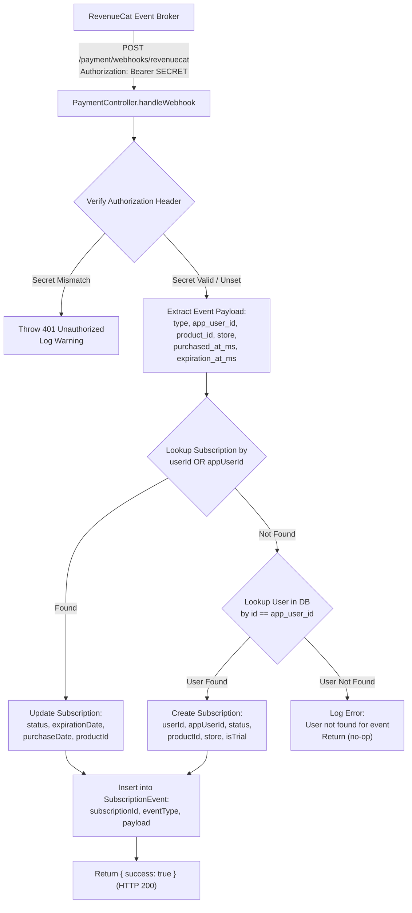

# Velvet & Iron Backend - Webhooks & External Event Ingestion

**Document ID:** `16-webhooks-events.md`  
**Target Audience:** Integration Engineers, Payment Engineers, DevOps Specialists  

---

## 1. Webhook Endpoints Inventory

The codebase exposes two external callback endpoints:

| Endpoint | Ingress Path | Triggering External Service | Protocol / Transport | Purpose |
| :--- | :--- | :--- | :--- | :--- |
| **RevenueCat Webhook** | `POST /payment/webhooks/revenuecat` | RevenueCat Event Engine | HTTPS POST with Bearer Secret | Synchronizes App Store & Play Store subscription states |
| **Discord OAuth Callback**| `GET /auth/discord/callback` | Discord OAuth2 Server | HTTPS GET with Auth Code | Receives OAuth code and profile claims |

---

## 2. RevenueCat Webhook Pipeline



### 2.1 Security & Signature Verification
* **Header Format:** `Authorization: Bearer <secret>`
* **Validation Rule:**
  ```typescript
  const webhookSecret = this.configService.get<string>('REVENUECAT_WEBHOOK_SECRET');
  if (webhookSecret && authHeader !== `Bearer ${webhookSecret}`) {
    this.logger.warn('Unauthorized RevenueCat webhook attempt');
    throw new UnauthorizedException('Invalid authorization header');
  }
  ```
* **Security Caveat:** If `REVENUECAT_WEBHOOK_SECRET` is left empty or not set in the environment, the verification check is bypassed entirely, allowing unauthenticated callers to forge subscription events!

### 2.2 Supported Event Types & State Transitions

| RevenueCat Event Type | Resulting Subscription Status (`status` column) | Meaning |
| :--- | :--- | :--- |
| `INITIAL_PURCHASE` | `active` | User completed initial purchase |
| `RENEWAL` | `active` | Recurring subscription renewed successfully |
| `UNCANCELLATION` | `active` | User re-enabled auto-renew before expiration |
| `NON_RENEWING_PURCHASE` | `active` | Fixed-period access purchase |
| `CANCELLATION` | `cancelled` | User canceled auto-renew (access remains until `expirationDate`) |
| `EXPIRATION` | `expired` | Subscription expired without renewal |
| `BILLING_ISSUE` | `billing_issue` | Payment method failed at renewal |
| *Other / Unknown* | `unknown` | Unrecognized event logged for audit |

### 2.3 Idempotency & Duplicate Events
* Every received webhook payload is written immutably into `SubscriptionEvent` with timestamp `receivedAt`.
* Updates to the primary `Subscription` table are idempotent (re-applying the same status and dates does not alter business logic).

---

## 3. Discord OAuth Callback Pipeline

* **Endpoint:** `GET /auth/discord/callback`
* **Trigger:** User completes authorization on `discord.com`. Discord redirects user browser to backend callback with temporary query string code: `?code=AUTHORIZATION_CODE`.
* **Processing:**
  1. Passport `DiscordStrategy` intercepts request and performs token exchange with Discord token endpoint.
  2. Extracts Discord user profile: `id`, `username`, `email`, `avatar`.
  3. `AuthService.discordAuthCallback()` handles database lookup and account creation.
  4. Generates application JWT tokens.
  5. Sets cookies and redirects browser to Flutter custom deep link (`velvetapp://auth/discordapp`).
* **Failure Handling:** If authentication fails or is cancelled by the user, the callback catches the error and redirects to the app with error parameter:
  ```text
  velvetapp://auth/discordapp?error=discord_auth_failed
  ```

