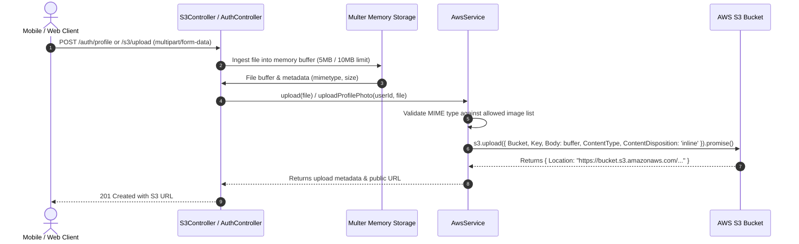

# Velvet & Iron Backend - File & Media Management

**Document ID:** `18-file-management.md`  
**Target Audience:** Backend Developers, Cloud Infrastructure Engineers, Mobile Developers  

---

## 1. Storage Architecture Overview

Velvet & Iron utilizes **Amazon Web Services Simple Storage Service (AWS S3)** for media persistence. Media ingestion is handled via **Multer memory storage** within NestJS controllers before streaming directly to S3 via the AWS SDK.



---

## 2. File Ingestion Pipelines

### 2.1 Profile Photos & Avatars
* **Endpoint:** `PATCH /auth/profile`
* **Guard:** `@ValidUser()`
* **Interceptor:** `FileFieldsInterceptor([{ name: 'profilePhoto', maxCount: 1 }, { name: 'avatar', maxCount: 1 }])`
* **Size Limit:** 5 MB (`5 * 1024 * 1024` bytes).
* **MIME Validation:**
  ```typescript
  const allowedMimeTypes = [
    'image/jpeg', 'image/jpg', 'image/png',
    'image/gif', 'image/webp', 'image/svg+xml'
  ];
  ```
  If an invalid MIME type is uploaded, Multer throws a `BadRequestException`.
* **S3 Key Structure:**
  ```text
  profiles/${userId}/avatar-${Date.now()}
  ```
* **Database Updates:** Persisted to `User.profilePhoto` or `User.avatar`.

### 2.2 Generic Single File Upload
* **Endpoint:** `POST /s3/upload`
* **Guard:** `NONE` (**Public Endpoint**)
* **Interceptor:** `FileInterceptor('file')`
* **Size Limit:** 10 MB (`10 * 1024 * 1024` bytes).
* **MIME Validation:** Any file format accepted.
* **S3 Key Structure:**
  ```text
  uploads/${file.originalname}-${Date.now()}
  ```

### 2.3 Batch Multiple File Upload
* **Endpoint:** `POST /s3/upload-multiple`
* **Guard:** `NONE` (**Public Endpoint**)
* **Interceptor:** `FilesInterceptor('files', 20)`
* **Limits:** Up to 20 files per request, max 10MB per file.
* **Execution:** Uploads processed concurrently via `Promise.all()`.

---

## 3. Storage Configuration & Access Control

* **AWS Bucket Configuration:**
  * Configured via `AWS_S3_BUCKET_NAME` (default in `.env.example`: `shamimrana2006`).
  * Region configured via `AWS_BUCKET_REGION` (default in `.env.example`: `eu-north-1`).
* **Access Permissions:**
  * Files are uploaded with `ContentDisposition: 'inline'`.
  * URLs are public direct links (`uploadResult.Location`).
  * **No Pre-Signed URLs:** Although `@aws-sdk/s3-request-presigner` is installed in `package.json`, pre-signed expiring download URLs are currently **not implemented**.

---

## 4. Security Risks & Critical Action Items

> [!WARNING]
> **High Security Risk: Unauthenticated File Upload Endpoints**  
> `POST /s3/upload` and `POST /s3/upload-multiple` in `src/s3/s3.controller.ts` have no authentication guards. Any anonymous internet user can upload arbitrary files up to 200MB per batch request into your S3 bucket.
> 
> **Immediate Action Required:**
> 1. Add `@ValidUser()` to `S3Controller`.
> 2. Implement strict file extension and MIME type allowlists on generic uploads.
> 3. Disinfect original filenames to prevent path traversal or special character corruption in S3 keys.

