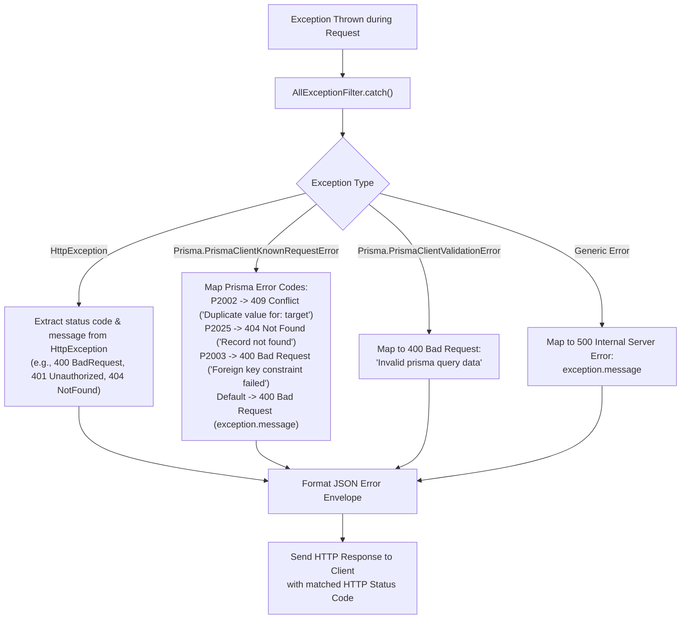

# Velvet & Iron Backend - Error Handling Architecture

**Document ID:** `19-error-handling.md`  
**Target Audience:** Backend Developers, QA Automation Engineers, Frontend Integrators  

---

## 1. Global Exception Filter Architecture

Every unhandled error, framework exception, and database failure is intercepted globally by `AllExceptionFilter` (`src/common/all-exception.filter.ts`), registered on application bootstrap in `src/main.ts`:

```typescript
app.useGlobalFilters(new AllExceptionFilter());
```



---

## 2. Standardized Error Response Envelope

All API errors return an RFC-compliant, consistent JSON format:

```json
{
  "success": false,
  "statusCode": 400,
  "timestamp": "2026-03-01T14:32:10.512Z",
  "path": "/meal-log",
  "message": "Carbohydrates must be a positive integer"
}
```

### Multiple Field Validation Error Response
When `ValidationPipe` encounters multiple field validation violations:
```json
{
  "success": false,
  "statusCode": 400,
  "timestamp": "2026-03-01T14:32:10.512Z",
  "path": "/auth/register",
  "message": [
    "email must be an email",
    "password must be longer than or equal to 6 characters"
  ]
}
```

---

## 3. Categorized Exception Scenarios

### 3.1 Validation Errors (HTTP 400)
* **Trigger:** DTO constraint violation via `class-validator` in `ValidationPipe`.
* **Configuration:**
  ```typescript
  new ValidationPipe({
    whitelist: true,              // Strips unexpected fields
    forbidNonWhitelisted: true,    // Rejects requests with unexpected fields
    transform: true,              // Transforms payloads to DTO class instances
    transformOptions: { enableImplicitConversion: true }
  })
  ```

### 3.2 Authentication Errors (HTTP 401)
* **Trigger:** Invalid password, invalid/expired JWT, invalid OTP, unverified email when required.
* **Examples:**
  * `"Both tokens are invalid"` (Thrown by `OptionalJwtGuard`)
  * `"Please verify your email before logging in"`
  * `"Invalid or expired OTP"`
  * `"Firebase token is invalid. Please provide a valid Firebase ID token."`

### 3.3 Authorization Errors (HTTP 403)
* **Trigger:** Authenticated user attempting to access a route restricted to another role.
* **Examples:**
  * `"Only ADMIN, SUPERADMIN can access this resource"` (Thrown by `RoleGuard`)
  * `"Access denied"` (Thrown by `OwnUserGuard`)

### 3.4 Resource Not Found Errors (HTTP 404)
* **Trigger:** Missing entity by ID or Prisma code `P2025`.
* **Examples:**
  * `"User not found"`
  * `"Theme not found"`
  * `"Companion not found"`
  * `"Record not found"`

### 3.5 Business Conflict Errors (HTTP 409)
* **Trigger:** Violating a unique database constraint (Prisma `P2002`).
* **Example:**
  ```json
  {
    "success": false,
    "statusCode": 409,
    "timestamp": "2026-03-01T14:35:00.000Z",
    "path": "/auth/register",
    "message": "Duplicate value for: email"
  }
  ```

