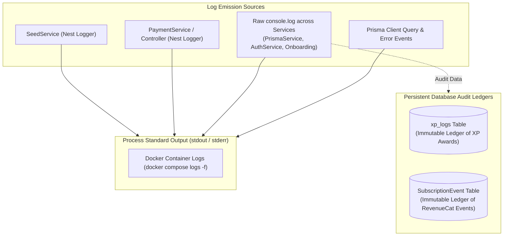

# Velvet & Iron Backend - Logging & Monitoring Architecture

**Document ID:** `20-logging-monitoring.md`  
**Target Audience:** DevOps Engineers, SREs, Backend Developers  

---

## 1. Current Logging Architecture

The application currently relies on a hybrid of NestJS built-in `Logger` instances and raw `console.log()` statements:



---

## 2. In-Code Logging Inventory

### 2.1 Formal NestJS `Logger` Instances
* `SeedService`: Logs database seed checks on startup with emoji status prefixes (`🌱 Checking seed data...`, `✓ Created theme`, `👑 Creating super admin...`).
* `PaymentController` & `PaymentService`: Logs webhook ingestion events (`Handling RevenueCat event: INITIAL_PURCHASE for user: uuid`) and unauthorized webhook attempts.

### 2.2 Raw `console.log` / `console.error` Statements in Production Code
* `PrismaService` (`src/lib/prisma/prisma.service.ts`):
  ```typescript
  console.log(this.env.get<string>('DATABASE_URL')); // DANGEROUS: Logs plaintext DB credentials on startup!
  console.log('data base connected');
  ```
* `OptionalJwtGuard` (`src/common/optional-auth.guard.ts`):
  ```typescript
  console.log('validate payload', payload);
  console.error('Scenario 2 - Access token regeneration failed:', err.message);
  ```
* `JwtStrategy`: Logs incoming JWT payload on every token validation request.
* `ProfileService`, `OnboardingController`, `MealLogController`: Logs incoming DTO parameters.

---

## 3. Persistent Database Audit Tables

Instead of file-based audit logs, the backend writes critical business events directly to dedicated relational tables:

1. **`xp_logs` Table:**  
   Records every change in user experience points with timestamp, amount, source (`'dayliLoggin'`, `'Meal log entry'`, `'Medication taken'`), and user ID.
2. **`SubscriptionEvent` Table:**  
   Stores the entire raw JSON payload of every RevenueCat webhook event received, associated with the primary `subscriptionId` and timestamp `receivedAt`.

---

## 4. Health Checks & Monitoring Deficiencies

### 4.1 Missing API Health Check Endpoint
* **State:** `NOT FOUND IN CODEBASE`
* **Observation:** There is no `/health`, `/healthz`, or `/ping` endpoint registered in NestJS (e.g. via `@nestjs/terminus`).
* **Consequence:** Cloud load balancers (AWS ALB) and container orchestrators cannot verify if the application is healthy and able to connect to PostgreSQL without querying an authenticated endpoint or Swagger UI.

### 4.2 Docker PostgreSQL Health Check
* Configured in `docker-compose.yml`:
  ```yaml
  healthcheck:
    test: ['CMD-SHELL', 'pg_isready -U postgres']
    interval: 10s
    timeout: 5s
    retries: 5
  ```

---

## 5. Production SRE Recommendations

1. **Eliminate Credential Logging:** Immediately remove `console.log(this.env.get<string>('DATABASE_URL'))` from `PrismaService` to prevent database passwords from leaking into system logs.
2. **Install NestJS Terminus (`@nestjs/terminus`):** Add a lightweight, unauthenticated `GET /health` endpoint monitoring Prisma database connectivity and memory usage.
3. **Structured Logging (Winston / Pino):** Replace raw `console.log` with a structured JSON logger emitting standardized fields (`timestamp`, `level`, `correlationId`, `userId`, `context`).
4. **Error Aggregation (Sentry):** Integrate Sentry or Datadog inside `AllExceptionFilter` to capture unhandled exceptions with full stack traces.

